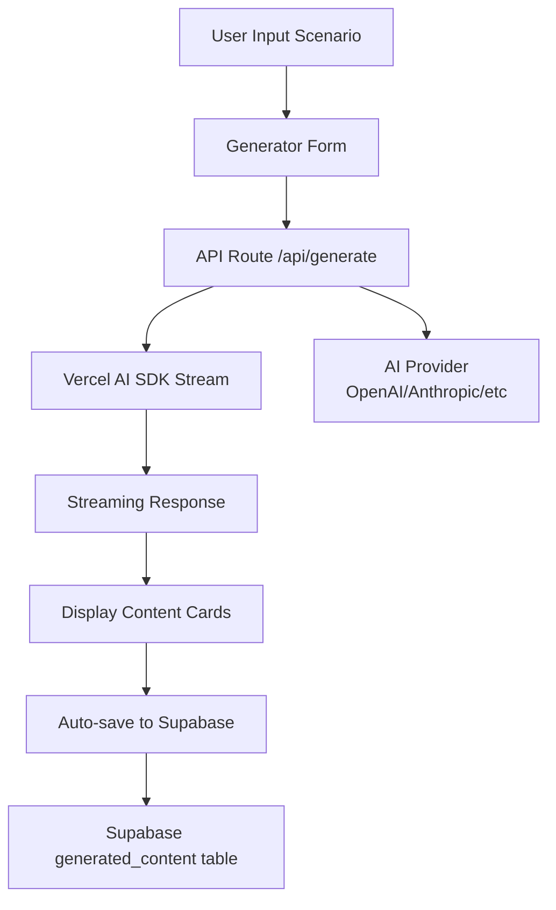

---name: Vercel AI SDK Integrationoverview: Implement AI-powered content generation using Vercel AI SDK with streaming responses and auto-save functionality. The system will generate D&D 5e characters, NPCs, environments, and missions based on user scenario descriptions.todos:

- id: install-ai-dependencies

content: ""status: pending

- id: create-rpg-types

content: Define TypeScript interfaces in types/rpg.ts for Character, Environment, Mission with full D&D 5e structurestatus: pending

- id: create-ai-lib

content: "Create lib/ai.ts with generateRPGContent() function - Phase 1: mock implementation with realistic data; Phase 2: replace with Vercel AI SDK generateObject()/streamObject() using GPT-4o-mini"status: pendingdependencies:

    - create-rpg-types
- id: create-generate-api

content: Create app/api/generate/route.ts POST endpoint - Phase 1: mock streaming with simulated delays; Phase 2: replace with real streamText() from Vercel AI SDK. Include user authentication and error handlingstatus: pendingdependencies:

    - create-ai-lib
- id: create-content-cards

content: ""status: pendingdependencies:

    - create-rpg-types
- id: update-generator-page

content: Update app/generator/page.tsx to call API, handle streaming responses with useChat() or custom hook, display content as it streams, and show loading statesstatus: pendingdependencies:

    - create-generate-api
    - create-content-cards
- id: create-save-api

content: Create app/api/content/route.ts POST endpoint for saving generated content to Supabase with validationstatus: pendingdependencies:

    - create-rpg-types
- id: create-supabase-schema

content: Create Supabase generated_content table with RLS policies (user_id, type, scenario_input, content_data, created_at)status: pending

- id: implement-auto-save

content: Integrate auto-save in generator page to call save API automatically after successful generation completionstatus: pendingdependencies:

    - create-save-api
    - create-supabase-schema
    - update-generator-page
- id: error-handling-ux

content: Add error boundaries, user-friendly error messages, loading skeletons, and success animationsstatus: pendingdependencies:

    - update-generator-page

---

# Vercel AI SDK Integration Plan

## Overview

Implement AI content generation using Vercel AI SDK with streaming responses. The system will generate structured D&D 5e content (characters, environments, missions) from user scenario descriptions and automatically save all generated content to Supabase.

## Architecture Flow




## Implementation Steps

### 1. Install Dependencies

**File**: `package.json`

- Add `ai` package (Vercel AI SDK)
- Add provider-specific packages (e.g., `@ai-sdk/openai` or `@ai-sdk/anthropic`)
- Default to OpenAI (`@ai-sdk/openai`) for initial implementation, but structure allows easy switching

### 2. Define TypeScript Types

**File**: `types/rpg.ts` (new)

- `Character` interface: name, race, class, level, background, history, personality, spells (array with name, level, description), skills (array with name, proficiency, modifier), traits, voiceLines (array), associatedMission
- `Environment` interface: name, description, ambient (sounds/atmosphere), mood, lighting, features (array), npcs (array of names/references)
- `Mission` interface: title, description, context, objectives (array with primary/optional flags), rewards (xp, gold, items array), difficulty, relatedNPCs, relatedLocations
- `GeneratedContent` type: union of Character | Environment | Mission
- Helper types: `ContentType`, `GenerationRequest`, `GenerationResponse`

### 3. Create AI Integration Layer

**File**: `lib/ai.ts` (new)**Phase 1 (Now)**: Mock implementation

- `generateRPGContent()` function with mock data generator
- Returns realistic structured JSON matching the types
- Simulates streaming delay for testing UI
- Commented placeholder showing where OpenAI integration will go

**Phase 2 (Later)**: Real OpenAI integration

- Replace mock with Vercel AI SDK `generateObject()` or `streamObject()`
- Uses `openai()` from `@ai-sdk/openai` with GPT-4o-mini model
- D&D 5e-focused prompt templates for each content type
- Structured schemas enforce output format (using Zod schemas with `zodToJsonSchema`)
- Examples included in prompts for better quality

**Prompt Engineering Strategy** (for Phase 2):

- System prompts include D&D 5e rules context
- User prompts format scenario descriptions
- Structured schemas enforce output format (using Zod schemas with `zodToJsonSchema`)
- Examples included in prompts for better quality

### 4. Create API Route for Generation

**File**: `app/api/generate/route.ts` (new)

- POST endpoint accepting `{ scenario: string, contentType: 'character' | 'environment' | 'mission' }`
- Authenticates user (verify Supabase session)
- Calls AI generation function (mock in Phase 1, real in Phase 2)
- Returns streaming response

**Phase 1 (Now)**: Mock streaming

- Simulates streaming using ReadableStream
- Returns mock data with realistic delays
- Structure matches real API response format

**Phase 2 (Later)**: Real streaming

- Use `streamText()` from `ai` package
- Return `StreamingTextResponse` for real-time streaming
- Format stream chunks appropriately for UI consumption
- Implements server-side error handling
- Rate limiting considerations (optional, can add later)

### 5. Update Generator Page

**File**: `app/generator/page.tsx` (modify)

- Replace placeholder `handleGenerate()` with actual API call
- Implement streaming response handling using `useChat()` or custom streaming hook
- Add state for generated content display
- Add loading states during streaming
- Display streaming text as it arrives (character-by-character or chunk-by-chunk)
- Show complete structured content once streaming finishes

**Streaming UI**:

- Display content cards while streaming
- Show loading indicators for incomplete fields
- Smoothly transition to complete display when done

### 6. Create Content Display Components

**File**: `components/rpg/character-card.tsx` (new)

- Displays Character data with medieval styling
- D&D 5e stat block formatting
- Expandable sections for spells, skills, traits
- Voice lines in quote format with medieval styling
- Show associated mission if present

**File**: `components/rpg/environment-card.tsx` (new)

- Displays Environment description
- Ambient sounds section
- Features list
- NPC references
- Mood/lighting indicators

**File**: `components/rpg/mission-card.tsx` (new)

- Displays Mission title and description
- Objectives list (primary vs optional)
- Rewards breakdown
- Difficulty indicator
- Related NPCs and locations

### 7. Implement Auto-Save Functionality

**File**: `app/api/content/route.ts` (new)

- POST endpoint to save generated content
- Accepts `{ type, scenario, contentData, userId }`
- Validates and inserts into Supabase `generated_content` table
- Returns saved content ID

**Auto-save Integration**:

- Modify generator page to auto-save after successful generation
- Call save API automatically when streaming completes
- Show save confirmation toast/notification
- Handle save errors gracefully (retry logic optional)

### 8. Create Supabase Database Schema

**Supabase Migration** (manual or via Supabase dashboard):

```sql
CREATE TABLE generated_content (
  id UUID PRIMARY KEY DEFAULT gen_random_uuid(),
  user_id UUID REFERENCES auth.users(id) ON DELETE CASCADE,
  type TEXT NOT NULL CHECK (type IN ('character', 'environment', 'mission')),
  scenario_input TEXT NOT NULL,
  content_data JSONB NOT NULL,
  created_at TIMESTAMPTZ DEFAULT NOW()
);

CREATE INDEX idx_generated_content_user_id ON generated_content(user_id);
CREATE INDEX idx_generated_content_type ON generated_content(type);
CREATE INDEX idx_generated_content_created_at ON generated_content(created_at DESC);
```

**Row Level Security (RLS)**:

- Enable RLS on `generated_content` table
- Policy: Users can only see/insert their own content
- Admin policy if needed for moderation

### 9. Environment Variables

**File**: `.env.local` (create/update)**Phase 1 (Now)**:

- No API key needed (using mocks)
- Structure ready for API key addition

**Phase 2 (Later)**:

- `OPENAI_API_KEY` - OpenAI API key for GPT-4o-mini
- Add key when ready to enable real AI generation
- Model will use `gpt-4o-mini` (cost-effective: $0.15/$0.60 per million tokens)

### 10. Error Handling & UX

- Add error boundaries for AI generation failures
- Show user-friendly error messages
- Retry logic for transient failures
- Rate limit indicators if needed
- Loading skeletons during generation
- Success animations when content appears

## File Changes Summary

### New Files

- `types/rpg.ts` - RPG content type definitions
- `lib/ai.ts` - AI generation logic using Vercel AI SDK
- `app/api/generate/route.ts` - Streaming generation API endpoint
- `app/api/content/route.ts` - Content save API endpoint
- `components/rpg/character-card.tsx` - Character display component
- `components/rpg/environment-card.tsx` - Environment display component
- `components/rpg/mission-card.tsx` - Mission display component

### Modified Files

- `app/generator/page.tsx` - Connect to AI API, handle streaming, auto-save
- `package.json` - Add `ai` and provider SDK packages
- `.env.local` - Add AI provider API key

## Key Technical Decisions

1. **Streaming**: Use `streamText()` for real-time user feedback
2. **Structured Outputs**: Use `generateObject()` with Zod schemas for type-safe JSON
3. **Auto-save**: Save immediately after successful generation (no manual button)
4. **Provider**: OpenAI GPT-4o-mini (structure ready, API key added later)
5. **Type Safety**: Full TypeScript coverage with Zod validation
6. **Development Approach**: Build structure first with placeholder/mock data, then add OpenAI integration when API key is available

## Dependencies to Add

```json
{
  "ai": "^3.x",
  "@ai-sdk/openai": "^1.x",
  "zod": "^4.2.1" // Already installed
}
```

**Note**: Dependencies can be installed when ready. Structure will work with mock data until API key is configured.

## Implementation Strategy (Two-Phase Approach)

### Phase 1: Structure & Mock Data (Now)

- Build all types, components, API routes structure
- Implement mock/placeholder AI responses for testing
- Complete UI/UX with streaming simulation
- Set up Supabase schema
- Make it easy to swap mock for real API

### Phase 2: OpenAI Integration (Later)

- Install `ai` and `@ai-sdk/openai` packages
- Add `OPENAI_API_KEY` to `.env.local`
- Replace mock functions with real OpenAI calls
- Test with GPT-4o-mini model

## Implementation Order

### Phase 1: Structure (Now - No API Key Needed)

1. Set up types and interfaces
2. Create mock AI integration layer
3. Build API route with mock streaming
4. Create content display components
5. Update generator page UI for streaming (works with mocks)
6. Implement auto-save API and integration
7. Create Supabase schema and test
8. Polish error handling and UX

### Phase 2: OpenAI Integration (Later - When API Key Available)

1. Install `ai` and `@ai-sdk/openai` packages
2. Add `OPENAI_API_KEY` to `.env.local`
3. Replace mock functions in `lib/ai.ts` with real OpenAI calls using GPT-4o-mini